<div align="center">

# 🎬 MediaGrabber PRO
### Advanced Web Video & MP3 Stream Downloader for Chromium

[](https://developer.chrome.com/docs/extensions/mv3/intro/)
[](LICENSE)
[](https://github.com/Cathhdyy/Web-Video-Downloader-Extenstion)
[](manifest.json)
[](CONTRIBUTING.md)

<p align="center">
  <b>Sniff, preview, transmux, and download high-definition videos, audio tracks, and HLS streams directly in your browser.</b><br/>
  Zero external server dependencies. 100% Client-Side Transmuxing with <code>mux.js</code>.
</p>

[Key Features](#-key-features) •
[Installation](#-installation-guide) •
[How It Works](#-architecture--how-it-works) •
[Project Structure](#-project-structure) •
[Permissions Disclosure](#-permissions--privacy) •
[Contributing](#-contributing)

---

</div>

## ✨ Key Features

| Feature | Description |
| :--- | :--- |
| 🔍 **Dual-Layer Sniffing Engine** | Combines background network inspection (`chrome.webRequest`) with in-page DOM observation (`<video>`, `<audio>`, `<source>`, blob URLs, and embedded players). |
| ⚡ **Client-Side HLS Transmuxing** | Downloads `.m3u8` multi-segment streams and transmuxes them directly into clean `.mp4` video files in your browser using bundled `mux.js`. No backend server or FFmpeg installation required. |
| 🎵 **Universal Audio & MP3 Support** | Dedicated detection and extraction for MP3, M4A, AAC, WAV, OGG, Opus, and FLAC streams. Supports stripping audio tracks directly from video feeds. |
| 🎬 **In-Popup Media Preview Player** | Built-in audio/video preview modal with scrubber, volume control, and playback rate so you can verify the content before downloading. |
| 🏷️ **Adaptive Quality & Metadata** | Parses master playlists to extract resolutions (4K, 1080p, 720p, 480p), bitrates, content length, and file sizes. |
| 📦 **Batch Operations** | Download multiple items simultaneously or copy all media URLs to clipboard with one click. |
| ⚙️ **Custom Filename Templates** | Format output filenames using dynamic tags: `{title}`, `{site}`, `{quality}`, `{date}`, and `{resolution}` with automatic illegal character sanitization. |
| 🧪 **Built-In Interactive Test Lab** | Includes an integrated testing suite (`test_lab.html`) pre-loaded with HTML5 video, audio, and live HLS stream samples to test detection routines. |
| 🛡️ **100% Private & Local** | No remote telemetry, no third-party tracking scripts, and no external analytics. Everything runs strictly inside your local browser sandbox. |

---

## 🚀 Installation Guide

MediaGrabber PRO is built for Manifest V3 and runs on all modern Chromium-based browsers (Chrome, Brave, Edge, Opera, Vivaldi, Arc).

### Step-by-Step Setup:

1. **Clone or Download this Repository:**
   ```bash
   git clone https://github.com/Cathhdyy/Web-Video-Downloader-Extenstion.git
   ```
   *(Or download the ZIP archive from GitHub and extract it locally.)*

2. **Open Extensions Manager in your browser:**
   - **Google Chrome**: Navigate to `chrome://extensions/`
   - **Brave Browser**: Navigate to `brave://extensions/`
   - **Microsoft Edge**: Navigate to `edge://extensions/`
   - **Opera**: Navigate to `opera://extensions/`

3. **Enable Developer Mode:**
   - Locate the **Developer mode** toggle switch (usually in the top-right corner) and switch it **ON**.

4. **Load the Extension:**
   - Click the **Load unpacked** button in the top toolbar.
   - Select the folder containing `manifest.json` (the repository root).

5. **Pin & Start Using:**
   - Click the puzzle piece icon (Extensions) in your browser toolbar.
   - Pin **MediaGrabber PRO** for easy one-click access.

---

## 🏗️ Architecture & How It Works

MediaGrabber PRO leverages a non-blocking asynchronous pipeline to intercept, catalog, and process media assets:

```mermaid
flowchart TD
    subgraph Browser ["Web Page & Network Traffic"]
        A["Active Tab / Streaming Website"] -->|"HTTP Requests"| B["chrome.webRequest Sniffer"]
        A -->|"DOM Elements (video & audio tags)"| C["Content Script Observer"]
    end

    subgraph Background ["Service Worker Engine"]
        B -->|"Analyze Headers / MIME"| D["Media Classifier & Deduplicator"]
        C -->|"Report Media Elements"| D
        D -->|"Update Badge Count"| E["Tab Badge Counter"]
        D -->|"Cache Records"| F["Session Media Store"]
    end

    subgraph UI ["Extension Popup & Options"]
        F -->|"Query Detected Media"| G["Popup Dashboard"]
        G -->|"Preview"| H["Embedded Media Player"]
        G -->|"Direct Download"| I["chrome.downloads API"]
        G -->|"HLS Stream (.m3u8)"| J["HLS Downloader Engine"]
    end

    subgraph Transmuxer ["Client-Side Processing"]
        J -->|"Concurrent Fetch"| K["TS Segments"]
        K -->|"Transmux via mux.js"| L["Merged MP4 Buffer"]
        L -->|"Save to Disk"| I
    end
```



### Supported Media Formats

| Category | Formats & MIME Types |
| :--- | :--- |
| **Video** | MP4 (`video/mp4`), WebM (`video/webm`), MKV (`video/x-matroska`), MOV (`video/quicktime`), FLV (`video/x-flv`), 3GP (`video/3gpp`), OGV |
| **Audio** | MP3 (`audio/mpeg`), M4A (`audio/mp4`), AAC (`audio/aac`), WAV (`audio/wav`), OGG (`audio/ogg`), FLAC (`audio/flac`), Opus |
| **Adaptive Streams** | HLS / M3U8 (`application/x-mpegurl`, `.m3u8`), MPEG-DASH (`application/dash+xml`, `.mpd`), Transport Streams (`.ts`) |

---

## 📂 Project Structure

```text
├── background/
│   └── service_worker.js       # Manifest V3 background worker & network listener
├── content/
│   └── content_script.js       # In-page DOM inspector for media elements & blobs
├── icons/
│   ├── icon16.png              # 16x16 toolbar icon
│   ├── icon48.png              # 48x48 extensions manager icon
│   └── icon128.png             # 128x128 Web Store / installation icon
├── lib/
│   ├── hls_downloader.js       # Multi-threaded HLS chunk fetcher & parser
│   ├── media_detector.js       # MIME-type, regex, and URL classification utility
│   └── mux.min.js              # Video.js muxer for client-side TS -> MP4 conversion
├── options/
│   ├── options.html            # Extension configuration panel
│   ├── options.css             # Settings styling (glassmorphism dark UI)
│   └── options.js              # Preferences storage & template customization logic
├── popup/
│   ├── popup.html              # Main popup dashboard UI
│   ├── popup.css               # Responsive modern styles & animations
│   └── popup.js                # Search, filter, preview player, and download orchestrator
├── test_lab/
│   ├── test_lab.html           # Interactive sandbox with live audio/video/HLS samples
│   ├── test_lab.css            # Test lab UI styling
│   └── test_lab.js             # Sample streams playback driver
├── .gitattributes              # Line endings & binary format definitions
├── .gitignore                  # Development and system ignore rules
├── CONTRIBUTING.md             # Developer contribution guidelines
├── generate_icons.js           # Icon creation and rendering script
├── LICENSE                     # MIT Open Source License
├── manifest.json               # Chrome Extension Manifest V3 configuration
├── package.json                # Project metadata & helper scripts
├── README.md                   # Repository documentation
└── SECURITY.md                 # Vulnerability disclosure policy
```

---

## 🧪 Interactive Test Lab

MediaGrabber PRO includes an internal **Test Lab** specifically designed for testing media sniffing and transmuxing routines without needing third-party streaming sites.

1. Open `chrome://extensions/`
2. Click **Details** under MediaGrabber PRO &rarr; **Extension options** &rarr; **Launch Test Lab** (or open `test_lab/test_lab.html` directly).
3. Experiment with:
   - Sample HTML5 MP4 video playback
   - High-quality MP3 audio stream
   - Live multi-bitrate HLS (.m3u8) adaptive stream
4. Click the extension icon to verify that all streams are accurately detected, categorized, and downloadable.

---

## 🛡️ Permissions & Privacy

MediaGrabber PRO adheres strictly to the Principle of Least Privilege:

| Permission | Why It Is Required |
| :--- | :--- |
| `webRequest` | Inspects HTTP response headers to identify video/audio MIME types without downloading full payloads. |
| `declarativeNetRequest` | Enables non-intrusive header observation for media stream requests. |
| `storage` | Saves user preferences (e.g., download naming templates, UI filters) locally via `chrome.storage.local`. |
| `downloads` | Triggers the browser's native download manager to save videos, audio tracks, and transmuxed MP4s. |
| `tabs` / `activeTab` | Determines the current domain and page title to accurately name files and associate media with the active tab. |
| `scripting` | Executes light DOM inspection scripts to locate `<video>` and `<audio>` tags embedded inside frames. |
| `<all_urls>` | Required so the media sniffer can intercept video streams across any website you visit. |

> **Privacy Guarantee:** MediaGrabber PRO does **not** collect, store, transmit, or monetize any user data, browsing history, or downloaded content. All analysis and file processing happen 100% locally in your browser.

---

## 🤝 Contributing

Contributions, feature requests, and bug reports are warmly welcome!  
Please review the [Contribution Guide](CONTRIBUTING.md) for local development instructions and workflow tips.

1. Fork the Project
2. Create your Feature Branch (`git checkout -b feature/CoolFeature`)
3. Commit your Changes (`git commit -m 'feat: Add CoolFeature'`)
4. Push to the Branch (`git push origin feature/CoolFeature`)
5. Open a Pull Request

---

## ⚠️ Disclaimer

MediaGrabber PRO is developed solely for personal backup and educational purposes. Users are responsible for complying with the terms of service of the websites they visit and applicable copyright laws in their jurisdiction. The developers assume no liability for misuse of this software.

---

## 📄 License

This project is licensed under the **MIT License** — see the [LICENSE](LICENSE) file for details.

<div align="center">
  <sub>Built with ❤️ by Cathhdyy & the open-source community.</sub>
</div>
