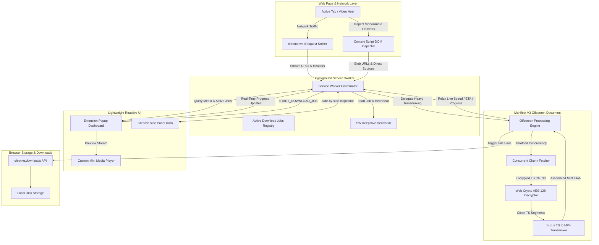

<div align="center">

# 🎬 MediaGrabber PRO
### Ultra-Fast, Private Web Video & Audio Stream Grabber for Chromium
#### Engineered with Chrome Manifest V3 • Offscreen Processing • Web Crypto AES-128

---

[](https://developer.chrome.com/docs/extensions/mv3/intro/)
[](.github/workflows/release.yml)
[](package.json)
[](LICENSE)
[](manifest.json)
[](types/index.d.ts)

<br/>

<p align="center">
  <b>Sniff, preview, decrypt, transmux, and download high-definition video, audio, and streaming media directly in your browser.</b><br/>
  <b>Zero external server dependencies. 100% Client-Side Transmuxing with <code>mux.js</code> and hardware-accelerated Web Crypto API.</b>
</p>

[✨ Key Features](#-key-features) •
[🏗️ Architecture](#️-architecture--pipeline) •
[🚀 Installation Guide](#-installation-guide) •
[⌨️ Keyboard Shortcuts](#️-keyboard-shortcuts) •
[🧪 Test Suite & CI/CD](#-automated-testing--cicd) •
[📂 Project Structure](#-project-structure) •
[🛡️ Privacy Pledge](#️-permissions--privacy) •
[🤝 Contributing](#-contributing)

---

</div>

## 🌟 Why MediaGrabber PRO?

Most video downloader extensions are built around legacy architectures that fail on modern video sites:
- ❌ **Popup Closes = Aborted Downloads**: When clicking outside an extension popup, traditional downloaders are immediately destroyed, canceling hours-long video downloads.
- ❌ **Encrypted Stream Failures**: Most extensions cannot decrypt AES-128 HLS streams, leaving users with unplayable fragments.
- ❌ **Network Saturation**: Unthrottled segment downloading freezes slower Wi-Fi networks and crashes browser tabs.
- ❌ **Privacy Risks**: Many downloaders silently pipe your browsing data to third-party tracking or conversion servers.

### 🛡️ The MediaGrabber PRO Solution:
- ✅ **Persistent Offscreen Processing**: Downloads run safely inside a dedicated Manifest V3 **Offscreen Document**. You can freely close the popup or switch tabs—downloads continue uninterrupted.
- ✅ **Hardware-Accelerated AES-128 Decryption**: Automatically parses `#EXT-X-KEY` and decrypts protected video segments using the native **Web Crypto API** (`AES-CBC`).
- ✅ **Bandwidth Concurrency Throttling**: Choose between 2, 4, or 8 concurrent streams in Settings to balance download speed with network stability.
- ✅ **100% Local & Private**: No analytics, no telemetry, no remote proxies. Every byte is inspected, decrypted, and saved strictly inside your local browser sandbox.

---

## ✨ Key Features

| Feature | Category | Description |
| :--- | :---: | :--- |
| 🚀 **Persistent Background Offscreen Transmuxing** | **Core Architecture** | Delegates chunk fetching, AES-128 decryption, and `mux.js` MP4 assembly to a background offscreen document. Active downloads survive popup closure without aborting. |
| 🔐 **AES-128 HLS Decryption Engine** | **Security & Streaming** | Native Web Crypto API (`crypto.subtle.decrypt`) integration to decrypt protected educational, webinar, and corporate HLS streams. |
| 📌 **Chrome Side Panel API Support** | **Productivity** | Dock MediaGrabber PRO directly alongside your browser viewport so you can inspect media in real-time during video playback. |
| 🎛️ **Custom Mini Media Player** | **UI/UX & Preview** | In-popup media player featuring an interactive scrubber, time readout, play/pause toggle, `-10s` replay, playback speed cycling (`1.0x` - `2.0x`), volume slider with mute memory, and dynamic audio waveform animations. |
| 🎨 **Adaptive Themes (Auto / Dark / Light)** | **Design System** | System Auto mode (adapts to OS theme), Ultra-Modern Glassmorphic Dark mode, and High-Contrast Daytime Light mode with instant one-click switching. |
| 🗂️ **Multi-Selection & Batch Actions** | **Bulk Management** | Master checkbox and per-card checkboxes to download (`Download (X)`), copy links (`Copy (X)`), or delete items (`Delete (X)`) in bulk. |
| ⚡ **Dynamic Master Quality & Bitrates** | **Media Detection** | Parses `#EXT-X-STREAM-INF` variants to extract real resolutions (`4K UHD`, `1080p FHD`, `720p HD`, `480p SD`) and real bitrates (e.g. `5.0 Mbps`). |
| 🔄 **Progressive Exponential Backoff** | **Resilience** | Automatically retries dropped TS chunks with progressive delays (`500ms`, `1500ms`, `3000ms`), preventing transient network hiccups from ruining downloads. |
| 🚦 **Bandwidth Concurrency Throttle** | **Network Controls** | Selectable concurrency in Settings (2 streams for low bandwidth/hotspots, 4 streams balanced, 8 streams turbo fiber). |
| 🏷️ **Smart Filename Formatting Engine** | **Automation** | Format output filenames using dynamic tokens (`{title}`, `{quality}`, `{resolution}`, `{ext}`, `{date}`, `{time}`, `{site}`) with a live preview box. |
| 🎵 **Lossless Audio Extraction** | **Audio Tools** | Extract pristine `.m4a` / `.mp3` audio directly from video streams without re-encoding quality degradation. |
| 🧪 **Built-In Interactive Test Lab** | **Developer Tooling** | Pre-bundled interactive sandbox (`test_lab.html`) with live HTML5 video, MP3 audio, and multi-bitrate HLS streams for immediate verification. |

---

## 🚀 Installation Guide

MediaGrabber PRO is built for Manifest V3 and runs on all modern Chromium-based browsers (Chrome, Brave, Edge, Opera, Vivaldi, Arc).

### Step-by-Step Setup:

1. **Clone or Download this Repository:**
   ```bash
   git clone https://github.com/Cathhdyy/Web-Video-Downloader-Extenstion.git
   ```
   *(Or download the ZIP archive from GitHub and extract it locally.)*

2. **Open Extensions Manager in your browser:**
   - **Google Chrome**: Navigate to `chrome://extensions/`
   - **Brave Browser**: Navigate to `brave://extensions/`
   - **Microsoft Edge**: Navigate to `edge://extensions/`
   - **Opera**: Navigate to `opera://extensions/`

3. **Enable Developer Mode:**
   - Locate the **Developer mode** toggle switch (usually in the top-right corner) and switch it **ON**.

4. **Load the Extension:**
   - Click the **Load unpacked** button in the top toolbar.
   - Select the folder containing `manifest.json` (the repository root).

5. **Pin & Start Using:**
   - Click the puzzle piece icon (Extensions) in your browser toolbar.
   - Pin **MediaGrabber PRO** for easy one-click access.

---

## 🏗️ Architecture & Pipeline

MediaGrabber PRO decouples UI interaction from media processing using Chrome Manifest V3 APIs:



### Supported Media Formats

| Category | Formats & MIME Types |
| :--- | :--- |
| **Video** | MP4 (`video/mp4`), WebM (`video/webm`), MKV (`video/x-matroska`), MOV (`video/quicktime`), FLV (`video/x-flv`), 3GP (`video/3gpp`), OGV |
| **Audio** | MP3 (`audio/mpeg`), M4A (`audio/mp4`), AAC (`audio/aac`), WAV (`audio/wav`), OGG (`audio/ogg`), FLAC (`audio/flac`), Opus |
| **Adaptive Streams** | HLS / M3U8 (`application/x-mpegurl`, `.m3u8`), MPEG-DASH (`application/dash+xml`, `.mpd`), Transport Streams (`.ts`) |

---

## ⌨️ Keyboard Shortcuts

| Shortcut | Context | Action |
| :---: | :---: | :--- |
| <kbd>Alt</kbd> + <kbd>Shift</kbd> + <kbd>D</kbd> | Global (Any Webpage) | Instantly opens MediaGrabber PRO popup to inspect media. |
| <kbd>Esc</kbd> | Inside Popup / Modals | Closes any open modal dialog (Preview Player, Settings, History, Help, Subtitles). |
| <kbd>Enter</kbd> | Inline Title Editor | Saves and commits the edited file title. |
| <kbd>Space</kbd> / <kbd>K</kbd> | Preview Modal | Toggle video / audio play and pause. |
| <kbd>Tab</kbd> / <kbd>Shift + Tab</kbd> | Popup Navigation | Full accessible focus navigation across cards, dropdowns, and batch buttons. |

---

## 🧪 Automated Testing & CI/CD

MediaGrabber PRO incorporates enterprise-grade engineering standards with zero external test bloat:

### Run Unit Tests Locally:
The test suite utilizes Node.js's native test runner (`node --test`), requiring zero external dependencies:
```bash
# Run all automated unit tests
npm test

# Run syntax verification across all modules
npm run check
```

### Test Coverage Highlights:
- **`HLSDownloader.parseM3U8`**: Validates master playlists, variant bitrate extraction, segment duration calculations, and AES-128 key URI & IV resolution.
- **`MediaDetector.inspectMedia`**: Tests MIME detection, noise rejection (canvas/short dummy loops), and protocol tagging.
- **`MediaDetector.formatFilename`**: Validates dynamic template tokens (`{title}`, `{quality}`, `{resolution}`, `{date}`, `{site}`) and illegal character stripping.

### Continuous Integration & Automated Releases:
Every push and pull request is automatically verified by [GitHub Actions](.github/workflows/release.yml):
- Executes on Ubuntu with Node 20.
- Runs full syntax checks (`npm run check`) and unit tests (`npm test`).
- On semantic version tags (`v*`), automatically builds and publishes a clean Chrome Web Store zip bundle to **GitHub Releases**.

---

## 📂 Project Structure

```text
├── .github/
│   └── workflows/
│       └── release.yml         # Automated GitHub Actions CI/CD release workflow
├── background/
│   └── service_worker.js       # Manifest V3 service worker & download job router
├── content/
│   └── content_script.js       # In-page DOM inspector for media elements & frames
├── icons/
│   ├── icon16.png              # 16x16 toolbar icon
│   ├── icon48.png              # 48x48 extensions management icon
│   └── icon128.png             # 128x128 Chrome Web Store icon
├── lib/
│   ├── hls_downloader.js       # AES-128 decryption, retry engine & transmuxer
│   ├── media_detector.js       # Classification, template formatter & sanitizer
│   └── mux.min.js              # Bundled Video.js muxer for TS -> MP4 conversion
├── offscreen/
│   ├── offscreen.html          # Dedicated offscreen execution environment
│   └── offscreen.js            # Background chunk fetcher, decrypter & builder
├── options/
│   ├── options.html            # Settings panel (throttle & filename templates)
│   ├── options.css             # Glassmorphism settings design
│   └── options.js              # Live template preview & storage persistence
├── popup/
│   ├── popup.html              # Modern popup dashboard with custom player
│   ├── popup.css               # Adaptive Dark / Light / Auto styling system
│   └── popup.js                # Theme switcher, multi-select & custom player logic
├── test/
│   ├── hls_downloader.test.js  # HLS parser, quality & AES-128 test suite
│   └── media_detector.test.js  # MIME classifier & template formatter test suite
├── test_lab/
│   ├── test_lab.html           # Interactive stream testing sandbox
│   ├── test_lab.css            # Sandbox styling
│   └── test_lab.js             # Sample stream playback controller
├── types/
│   └── index.d.ts              # Strongly-typed TypeScript declarations
├── .gitignore                  # Production ignore definitions
├── CONTRIBUTING.md             # Contribution guidelines
├── LICENSE                     # PolyForm Noncommercial License 1.0.0
├── manifest.json               # Chrome Extension Manifest V3 configuration
├── package.json                # Project scripts, dependencies & metadata
├── README.md                   # Comprehensive repository documentation
└── SECURITY.md                 # Vulnerability disclosure policy
```

---

## 🧪 Interactive Test Lab

MediaGrabber PRO includes an internal **Test Lab** specifically designed for testing media sniffing and transmuxing routines without needing third-party streaming sites.

1. Open `chrome://extensions/`
2. Click **Details** under MediaGrabber PRO &rarr; **Extension options** &rarr; **Launch Test Lab** (or open `test_lab/test_lab.html` directly).
3. Experiment with:
   - Sample HTML5 MP4 video playback
   - High-quality MP3 audio stream
   - Live multi-bitrate HLS (.m3u8) adaptive stream
4. Click the extension icon to verify that all streams are accurately detected, categorized, and downloadable.

---

## 🛡️ Permissions & Privacy

MediaGrabber PRO adheres strictly to the Principle of Least Privilege:

| Permission | Why It Is Required |
| :--- | :--- |
| `webRequest` | Inspects HTTP response headers to identify video/audio MIME types without downloading full payloads. |
| `declarativeNetRequest` | Enables non-intrusive header observation for media stream requests. |
| `offscreen` | Runs heavy video transmuxing, AES-128 decryption, and chunk fetching in the background without risk of popup closure aborts. |
| `sidePanel` | Allows docking the media sniffer side-by-side with video playback. |
| `storage` | Saves user preferences (e.g., concurrency throttle, naming templates, themes) locally via `chrome.storage.local`. |
| `downloads` | Triggers the browser's native download manager to save videos, audio tracks, and transmuxed MP4s. |
| `tabs` / `activeTab` | Determines the current domain and page title to accurately name files and associate media with the active tab. |
| `scripting` | Executes light DOM inspection scripts to locate `<video>` and `<audio>` tags embedded inside frames. |
| `<all_urls>` | Required so the media sniffer can intercept video streams across any website you visit. |

> **🔒 Privacy Guarantee:** MediaGrabber PRO does **not** collect, store, transmit, or monetize any user data, browsing history, or downloaded content. All analysis and file processing happen 100% locally in your browser.

---

## 🤝 Contributing

Contributions, feature requests, and bug reports are warmly welcome!  
Please review the [Contribution Guide](CONTRIBUTING.md) for local development instructions and workflow tips.

1. Fork the Project
2. Create your Feature Branch (`git checkout -b feature/CoolFeature`)
3. Commit your Changes (`git commit -m 'feat: Add CoolFeature'`)
4. Push to the Branch (`git push origin feature/CoolFeature`)
5. Open a Pull Request

---

## ⚠️ Disclaimer

MediaGrabber PRO is developed solely for personal backup and educational purposes. Users are responsible for complying with the terms of service of the websites they visit and applicable copyright laws in their jurisdiction. The developers assume no liability for misuse of this software.

---

## 📄 License

This project is licensed under the **PolyForm Noncommercial License 1.0.0** — see the [LICENSE](LICENSE) file for details. Free for personal, educational, and open-source non-commercial use; commercial use and monetization are strictly prohibited.

<div align="center">
  <sub>Built with ❤️ by Cathhdyy & the open-source community.</sub>
</div>
